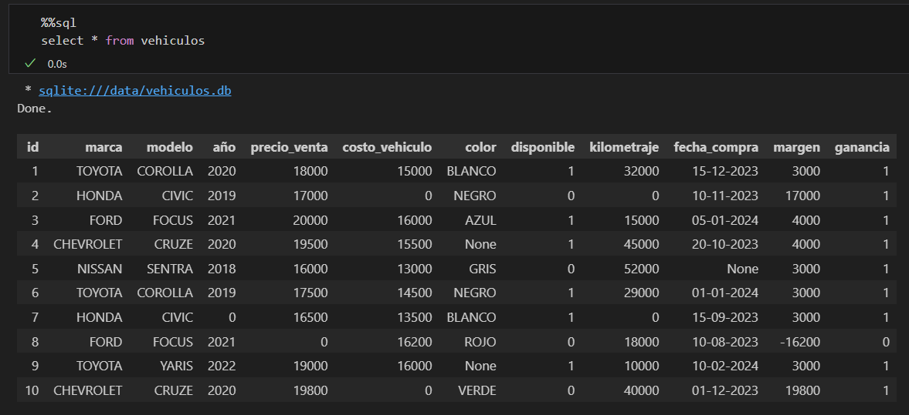

# Prueba tecnica j2l

## ETL
EL script *etl.py* tiene la siguiente estructura
* extract()
* transform()
* load()

### extract
```python
def extract(filepath) -> pd.DataFrame:
    logging.info(f"Extracting data from {filepath}")
    return pd.read_json(filepath)
```
Se carga el contenido del archivo *data/test_tecnico.json* a un dataframe de pandas.

### transform
```python
def transform(df: pd.DataFrame) -> pd.DataFrame:
    transfomed_df = (
        df.pipe(string_normalization, schema=SCHEMA)
        .pipe(coalesce_cols)
        .pipe(change_column_name, schema_change=NAME_CHANGE)
        .pipe(handle_blanks, schema=SCHEMA)
        .pipe(format_date, schema=SCHEMA)
        .pipe(calculations, calculations=CALCULATIONS)
    )
    logging.info("Transforming vehicle data.")
    return transfomed_df
```
Utilizando la característica *pipe* de pandas se aplican las transformaciones de forma secuencial en el conjunto de datos. Ver la documentación de las transformaciones en [transforms.py](transforms.py)

### load
```python
def load(df: pd.DataFrame) -> bool:
    con = DatabaseConnection()
    with con.get_connection() as connection:
        rowcount = df.to_sql('vehiculos', con=connection, dtype=DB_SCHEMA, index=False, if_exists='replace')
        logging.info(f"Succesfully loaded {rowcount} rows.")
```
Se crea una conexión de tipo *DatabaseConnection* (se utilizo una clase con el objetivo de simplificar el código, en el futuro se podrían manejar cursores de forma fácil usando la clase), y se insertan los datos a la BD. Se utiliza la condición *replace* para no crear duplicidad en los datos.

### Resultados
A continuación se muestra la tabla final con las transformaciones requeridas.
